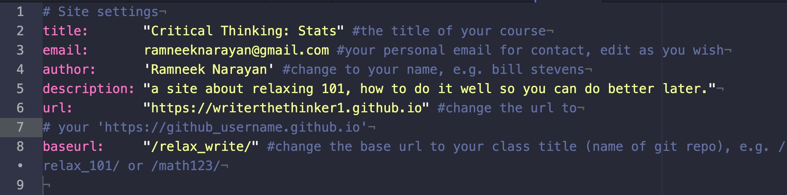
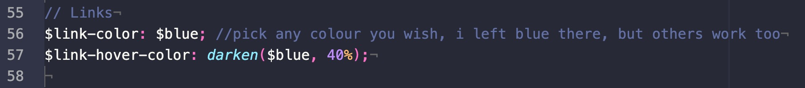

Pixyll.classes: pixylled for learning!

All adapted from [pixyll.com](http://www.pixyll.com) by [johno](https://johno.com). Check his original blog out! You can see other customization features there too! Social icons, formatting and other technical things.

It takes maybe 1 hour to learn, but once you do, you can teach many STEM courses. It has the basics for file storage, markdown articles, and many other features to make teaching and communication easy and accessible to those online or with a mobile phone access. It amounts to basic markdown file making as well as moving things into folders. Customization is also there in the _config.yml file. It's a lot, but if anyone takes the time to master it, they can become skilled at sharing ideas as well as teaching clearly! Adapt it to your needs.

## Setting up Jekyll

Before going on and reading more, *the first thing you'll need is to have jekyll set up and running*. You'll know it's set up and running when you can run a local server and visit the local version of your site via a web browser. Instructions for setting up jekyll are given at the main site right [here!](https://jekyllrb.com/docs/installation/). It depends on what operating system you have: mac, windows, ubuntu, other linux distributions. Basically, if you run a linux or a mac you'll be...

1. installing ruby if you don't have a version
2. installing the jekyll gem with bundler
3. setting the paths for ruby and jekyll so your system knows how to use them...

It's basically the same idea with a windows distribution was well just with some minor changes, just read the installation guide for the operating system you have.

> Once you have jekyll and ruby installed you can test and see if you can run a basic website and whether the required items have been installed (verify) by cloning the `test` repo and running `bundle install` and then `bundle exec jekyll serve` if you use bundler and `jekyll serve` if you don't use bundle. You'll see a basic webpage telling you that you have installed everything correctly.

> You can clone the `test` repo I made using `git clone https://github.com/writerthethinker1/test.git` on your terminal. If you'd like, you can make your own sample site as well by following the instructions [here!](https://jekyllrb.com/docs/step-by-step/01-setup/).

From here, you can move on and start learning more! Just make sure you can

1. have jekyll and ruby installed
2. run a local web server (for preview)

before moving on...

## Basic Features

This is a nice site for hosting a course. It comes complete with an announcements page, information telling about you, your contact information for the course, as well as a materials page. Within the materials page you'll find links to the syllabus, discussions, notes (downloads and pages), practice problems, musings, how to relax a little, and student scores ('your scores'). Basically, it takes care of all the formatting you need to do to write cool and nice appearing articles for the various course related content that you would like without taking care of links, formatting, and latex coding with `.tex` files. You can also upload your own materials directly in the `notes_upload` folder (more in this file about it) and have them appear as links ready to download or read if you choose a markdown file to write.

The basic workflow is...

1. make markdown files or upload materials, use the code in `compose.sh` and/or `upload.sh`; or do it manually
2. test out the site using jekyll, have a local server
3. check what's changed using `git status`
4. add the changes using `git add .`
5. check what's added using `git status`
6. commit the changes using `git commit -m "my changes message"`
7. push over to github's cloud using `git push origin master`

## Your own copy

Getting your own copy of this repo is easy, assuming familiarity with git, you can fork it right now if you'd like, then clone it using `git clone [your_repo's_url.git]` (we assume basic familiarity with git tools as well as github). If you want to run it locally (your computer) for a preview, however, you'll need jekyll on your computer too.

## Customizing your site

Once you have the site ready to go, up and running locally, you can make it your own! You need to change

1. the site's title, url, baseurl, email, author, and description
2. any types of folders (quizzes, midterms) you don't use
3. all the sample files that came with the site

We'll walk you though this step by step. You'll find everything to change in the first couple of lines of the `_config.yml` as given below



The second line has the title of the site, what you'd like be in the top left corner to let others see which class they are in; it's also a home button as well. The third line as your email that you can use as reference when making posts or telling people more about yourself by writing `[email_link_name]({{ site.email }})`. The fourth one has the author or writer of the site, feel free to put your name there, *just make sure to have your name be in the `''`*. The fifth line has the description of the site, you can adapt it to your needs and change it.

#### Getting the url to match your classes

The sixth line has the site's url, github pages always makes your url with the format `https://github_username.github.io` where the `github_username` is yours. For example, if the username is `computer_coder`, then the url reads `https://computer_coder.github.io`. My username is `writerthethinker1` so the url is `https://writerthethinker1.github.io`. The last line has the site's base url, *this is the extension to the main one you just made* you just have to write the title of your course in between the `/../` seen above. Mine is `/relax_write/` so when others want to go to my class, all they have to do is visit the url `https://writerthethinker1.github.io/relax_write/` and they are there! If you are teaching `math202`, then all you have to do is write `/math202/` for the baseurl. All in all, the url you will be having is given as

`https://github_username.github.io/your_class_name/`

#### What if I don't use quizzes or other things?

If you don't use certain course features, no worries! You can edit them by...

1. going to the `_data/` folder and change the `show: true` feature to `false`

The files there are for the various pages on the site, so if you want to change the materials page items, edit `_data/materials.yml`, if you want to change what's on the notes page, edit `_data/notes.yml`, and if you want to change what's on the scores page, edit the `_data/scores.yml` page.

For example, if I don't do quizzes for the course, all I have to do is go to the `_data/notes.yml` and `_data/scores.yml` and turn `show: true` for the quizzes section to `show: false` and the quizzes section won't appear nor will any files already put here as samples show up as well.

> Just make sure to change and visit all the `.yml` pages for the desired item. You might find quizzes in more than one `.yml` and need to change the `show: true` to `show: false`.

You can always delete the files (sample articles and images) and suit to your own needs.

### Changing Highlight Colours for Links (mood, own style)

You can change the highlight colour for the site too! It comes with <span style="color:#0076df">blue</span> as the default colour. If you want to change the colour to the other presets there are such as green, red, yellow, and others, you just have to go to `./_sass/_variables.scss` and change the `$link-color: $blue;` to the colour you'd like. If it's green, then you'd write `$link-color: $green;` and then it's green, the highlight color. The total colours that available are: `$blue`, `$red`,`$green`, `$purple`, `$dark-blue`, `$light-green`, `$light-pink`, and `$light-green`. The part to change is given below:



### Composing .md Files (various locations)

To compose your own posts, announcements, musings, discussions, labs, and so on you can use the templates given in the `_templates` folder.

They contain information about formatting and the way they are written contains the the `types` as well as the the `published` feature for you to have a post be visible when you push to git's repository.

We've added a convenient `compose.sh` code that can be added to your .zshrc or .bashrc for easy making of new files in the right format. To use it, make sure it's in the .zshrc or .bashrc file and use `source ~/.zshrc` or `source ~/.bashrc` or modify it as a `.sh` executable. You can write `compose [topic] [your_file_name (no extension)]` to have it appear in the right folder templated and ready to start writing. More detailed instructions are given in the `compose.sh` file. It makes writing the various topics easier.

You can write markdown pages for...

> articles, books, coding, disc_solutions, exam_solutions, extra_things, labs, practice_solutions, quiz_solutions, study_guides, week_notes, announcements, discussion, final_scores, lab_scores, midterm_scores, musings, practice_scores, practice quiz_scores

and when you write the topic in the `compose .. ..` part on a terminal you can pick from the above. For example, if you want to write exam_solutions for a final, just type

> compose exam_solutions final_spring

and the file `2021-04-12-final_spring.md` will appear in the `./materials/course_files/notes/exam_solutions` folder. *Just make sure to type out the topics in the block-quote exactly, the code will prompt you if there's an error.*

### Putting images in announcements or lectures

You can put images inside any markdown file like announcements or lectures. You can put images for the course within the `./images` folder. Feel free to add subfolders as well to organize how you might put things. For example, we've left the `./images/colours` folder there to organize images about colours. You might add `./images/graphs` `./images/week1_images` and other course related folders. Please read the file `./images_notes/images_notes.md` that contains all of the information that you need to start embedding images and customising their sizes.

## Uploading Material

The repo comes with an `upload.sh` file that you can add to your .zshrc or .bashrc configuration to upload files to the target directories. All you have to do once it's configured is write `upload destination_folder path/to/file_or_directory` and it puts it there for you. The destination folders you can pick from are...

`articles`, `books`, `coding`, `discussion_stuff`, `exam_solutions`, `extra_things`, `labs`, `practice_solutions`, `quiz_solutions`, `study_guides`, and `week_notes`.

That's 11 folders you can pick from.

> If you want, you can also just move files and folders manually into the desired folder in the `notes_upload` folder, that works too! Sometimes that's easier too...

> All the upload.sh utility does is do a 'cp file_or_dir ./notes_upload/where_you_want' just with smaller words to save time, but a simple drag and drop into the folders does the same thing, only you won't have a copy for you left...


### Hiding Posts from View (published in yml)

If you aren't ready to post something, all you have to do is leave the `published` portion of the front matter to 'false' and it won't show up when you push the content to github. It will look like

```
published: false
```

when you don't want others to see it and

```
published: true
```

when you do want others to see it.

### Custom Math/Stats/Chem/Physics Macros in Latex

This site comes with custom macros for math, statistics, chemistry, and physics. You can read up on all the amazing cool features on the announcements page at [my site](https://writerthethinker1.github.io/relax_write/), they are the first 4 announcements. You can also colour and cancel equations for better explaining as well! If you ever want to add your own macros, you can go to `./layouts/default.html` and edit the javascript section where there are macros:

```
TeX: { equationNumbers: { autoNumber: "AMS" },
        Macros: { // add your own macros here!
                  macro: "\\left(x^2\\right)",
                  macro2: "\\left[x^3\\right]",
                  macro3: ["\\left[#1\\right]", 1] }}
});
```

and follow suit from the 2 given above, the first part before the colon `:` is the macro's name and the part in quotes is the part where you put the latex code, just make sure that you escape the '/' before each macro and if you are having a macro with 1 or more inputs, enclose them with brackets `[..]` and keep the macro syntax in quotes `".."` and seperate them with a comma `,` followed by the number of arguments you want. Every macro you make needs to be seperated from the next on with a comma `,` and a new line except for the last (you can see all of that in the above code).


### Using tags

There are many tags you can use to make announcements more clear to your students and yourself as well. They are there to help you organize the message you want to announce. We've included a total of 17 tags which are `correction`, `course_work`, `discussions`, `emergencies`, `exams`, `grades`, `holiday`, `late_work`, `logistics`, `office_hours`, `questions`, `re_grades`, `registration`, `reminders`, `scores`, `sick`, and `solutions`. To add one, you just have to add the name in between the double quotes in the front matter:

```
tag: "your_tag"
```

For example, if you wanted and announcement about late work, you could write

```
tag: "late_work"
```

and it will have that tag. *Just make sure to write out the tag name exactly as given by the file names in the `./tag` folder or else it won't link correctly.

You can also have multiple tags as well, just make sure you separate them with a comma `,` and enclose them with brackets as in

```
tag: ["late_work", "re_grades"]
```

and both tags will be included in the post. If you want to make your own tags, it's easy! Just make a file in the `./tag` called `{my tag name}.md` (like `course_evals.md`) and add this in the file:

```
---
layout: tagpage
title: "Your Tag Title" #e.g. "Course Evals Tags"
tag: "tag_title" #e.g. "course_evals"
---
```

### Easy Links (Syllabus, Notes, Week Notes, Articles, and so on...)

Making links to important course materials like syllabi, notes, week notes, articles, labs, and so on is easy using the markdown syntax

```
[my link title](link reference)
```

The difference this time is that `link reference` is now replaced with liquid notation `{{ site.topic | relative_url }}` where the `relative_url` tells the system to prepend the url for your class site then add the rest of the link for the topic you are interested in. The topics you can easily reference are `syllabus`, `discussion_link`, `notes`, `musings_link`, `practice_link`, `calm_down`, `your_scores_link`, `coding`, `week_notes`, `discussion_stuff`, `practice_solutions`, `exam_solutions`, `quiz_solutions_link`, `study_guides`, `labs`, `books`, `articles`, and `extra_things`. The ways to write the various links inside the `(..)` for the markdown syntax are given below:

`{{ site.your_scores_link | relative_url }}`, `{{ site.syllabus | relative_url }}`, `{{ site.discussion_link | relative_url }}`, `{{ site.notes | relative_url }}`, `{{ site.musings_link | relative_url }}`, `{{ site.practice_link | relative_url }}`, `{{ site.week_notes | relative_url }}`, `{{ site.discussion_stuff | relative_url }}`, `{{ site.practice_solutions | relative_url }}`, `{{ site.exam_solutions | relative_url }}`, `{{ site.quiz_solutions | relative_url }}`, `{{ site.study_guides | relative_url }}`, `{{ site.labs | relative_url }}`, `{{ site.books | relative_url }}`, `{{ site.articles | relative_url }}`, `{{ site.extra_things | relative_url }}`, `{{ site.coding | relative_url }}`, `{{ site.calm_down | relative_url }}`

> Feel free to copy and paste if you want an easy reference. If you want to reference a discussion, you might write "You can find the next discussion materials right `[here]({{ site.discussion_link | relative_url }})"`Just an example of usage.

## Making Sketches

Sketches is a place to store anything related to the course for your own keeping to be given later or just kept there. Things you're unsure about uploading or just a spot to hold things. Whatever's in there won't be a webpage for people to see. One might put `experimental_ideas` as a folder in the `_sketches` folder. We've left two `.js` files for seeing the statistics and math macros added to the site that you can edit and have render for your site, if you want. Or just learn the macros given. There are a total of 196 macros to make various math, physics, and statistical thinking easier on the hands.

---

### Method of Learning

The method of learning places less emphasis on grades and more on what you guys have actually learned.

So, if the majority of people in the class can't solve or think critically about a problem, it's off the grading list and grades are high. Then, the problems are revised and given again as practice problems, definitely on the last exam as well.

> **If no one's getting any of the concepts, then there's no point in continuing further. The same re-done problems are coming back on the practice problems. That defeats the point of a course and makes it more for the instructor than the people who signed up.**

Basically, as a rough measure, I took the emphasis on grades and marks off. I took the nominal idea of one and gpa's and the other rubbish I didn't agree with off and went straight to the ideas and assume those who came wished to actually learn. I found things more relaxing and I learned better and was more creative by it. So, if you do score poorly, don't look at the score! Look more at what you didn't do, that's what led to it and be mindful of it. It's just a tinny course in the many other things life has. It's a no stress, chill place. Enjoy life for once and be creative.

There's also room for make-ups: alternate practice problems, and exams given during holidays for those struggling with D-F's. No make up finals, but everything prior can be made up. Problems and exams are easy to make so there's no trouble giving them to people who do want to do better. I found it sad to see others lose that 'will pass' mentality after some small poor marks. It's easy for me give them too, I just have to watch and see them. And there's not that many people, so it's just a day for me. Maybe a week end too? I'm fine doing that.

> But, you're free to go in your own direction with things, place emphasis on marks and and other things besides the problems and creative thinking that actually made the subjects you teach. I won't get in the way of your 'ego' :).

But, I do share my personal tips for learning, I hope collectively they help others...

#### Wisdom

1. relate it to your goals
2. find one thing you like about what you are learning now
3. see how it can help you later in the future
4. take your mistakes easy, be mindful about them
5. find one question about what you've learned
6. tie it all back to the place you live as well as life in general
7. be okay with failing or being wrong!!! (wise people are).
8. connect an idea with another subject

Wishing you joy and calmness no matter the time and event! Enjoy learning!
